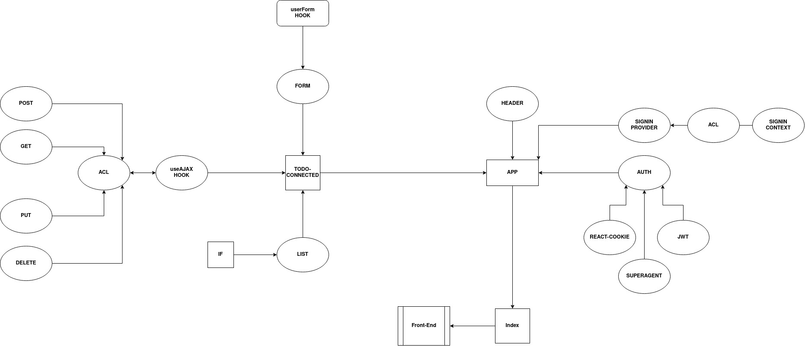

# todo

## Author

Amjad Mesmar

## About

A simple to do list web application that allows the user to create to do notes, edit and delete them, it uses custom hooks and axios to get get REST methods and api requests.

## Links

[Repository](https://github.com/AmjadMesmar/todo)
[Pull Request](https://github.com/AmjadMesmar/todo/pull/10)
[Deployed App](https://souls-todo.netlify.app/)

## UML Diagram

### LOCAL TODO UML Diagram

### TODO CONNECTED UML Diagram

### TODO AUTH UML Diagram

